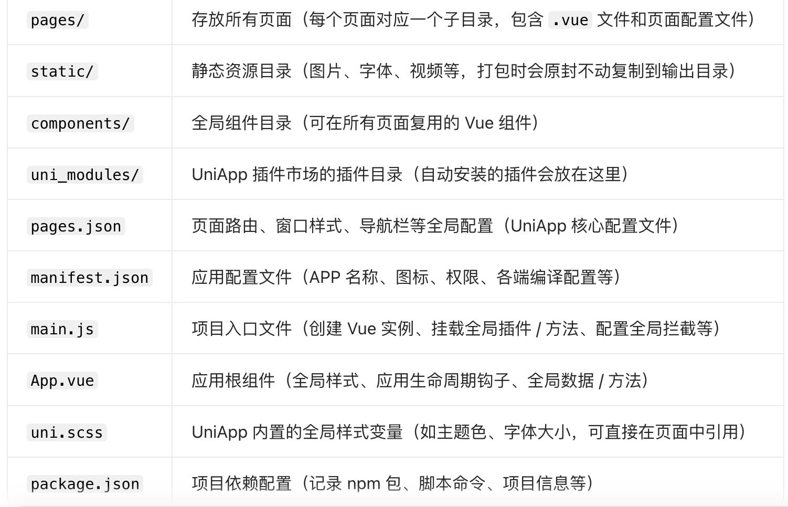
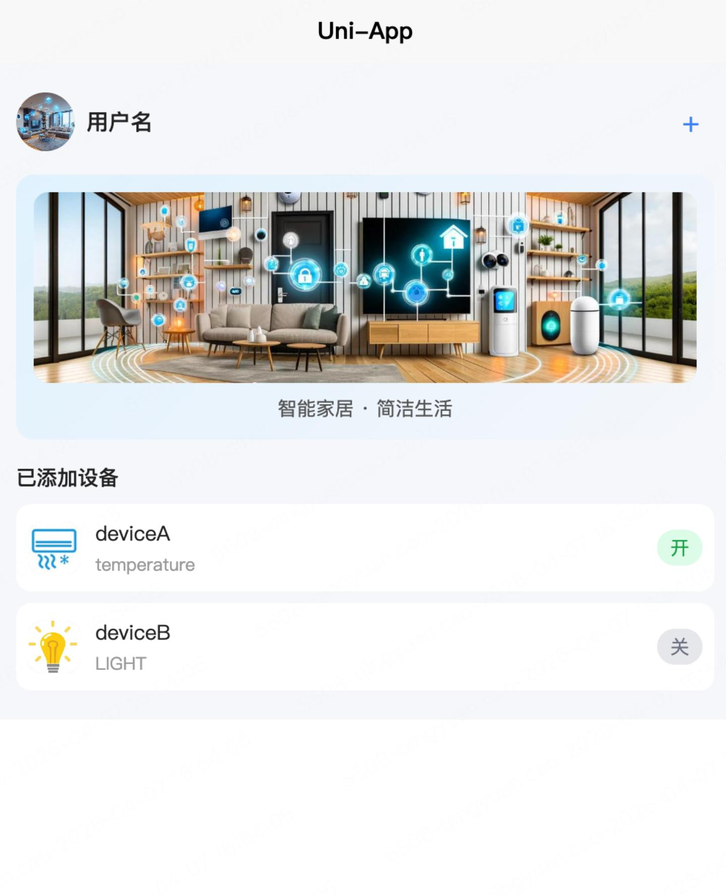
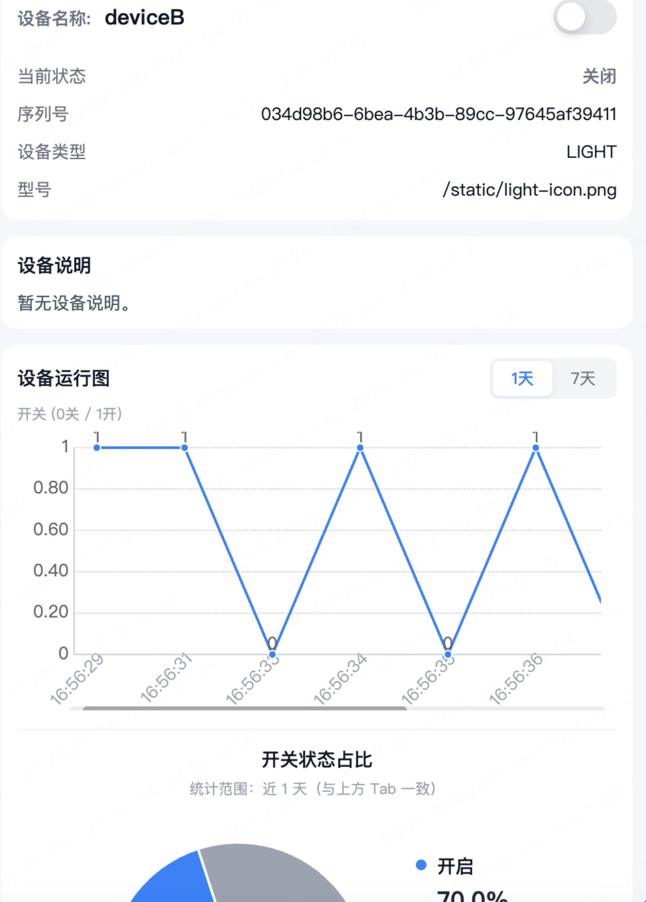

## IOT app介绍

首页

右上角+允许去添加新的设备，添加完成后，会在当前已添加设备进行列表展示

详情页

点击设备，会进入详情页。对于简单的开关机设备，会展示设备开关折线图和饼状图，展示各个状态的占比。
其他设备仅会展示相关信息。

## vue文件介绍
1. 一个 .vue 文件包含 3 个核心部分
* <template>
  <!-- 1. 模板区：页面/组件的结构（必须有且只能有一个根节点） -->
</template>

